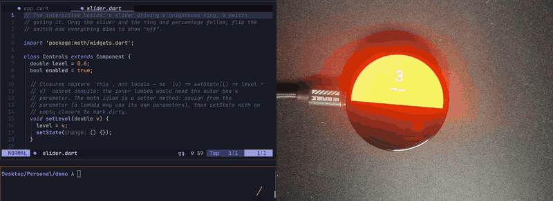
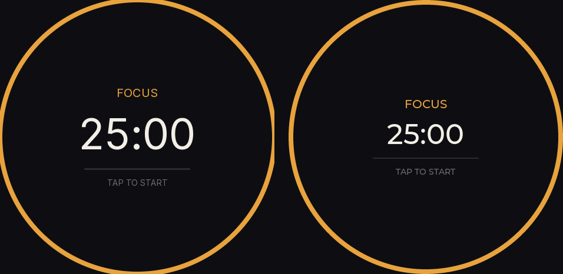

# moth

**Flutter's programming model on a $6 microcontroller.**

moth lets you write UI and application logic for ESP32-class microcontrollers in
real Dart — widgets, `setState`, `build()` — and run it on-device via a small
bytecode VM, drawing through moth's own renderer. The VM, the renderer, the
bindings and the bundled fonts together add about 90 KB of flash on top of
ESP-IDF (`idf.py size-components`: 48 KB code + 42 KB data, most of the
data being glyph tables).

```dart
import 'package:moth/widgets.dart';

class Counter extends Component {
  int count = 0;

  Widget build() {
    return Container(
      color: 0xFF1A1B26,
      flex: 1,
      onTap: () => setState(() => count += 1),
      child: Center(
        child: Text('tapped $count times',
            style: TextStyle(fontSize: 20, color: 0xFFF2EFE7)),
      ),
    );
  }
}

void main() {
  runApp(Counter());
  while (true) {
    pumpFrame(16);
    delay(16);
  }
}
```

Named parameters, `setState`, the widget names you know — and pushing a
change to the board over the USB cable takes one command and well under a
second, no reflash. See [ROADMAP](docs/ROADMAP.md).

This is what that feels like — one unedited take: `moth run`, a device
picker because two boards are plugged in, a color edit in the editor,
and `r` — the panel is orange before the logs settle:


Touch is renderer-owned, so controls track a finger without the VM in the
frame loop — this is [`examples/ui/controls.dart`](examples/ui/controls.dart)
pushed over the same running session:



Run the clips yourself from a checkout: the first is
[`examples/ui/hello.dart`](examples/ui/hello.dart) (the same program
`mothc create` scaffolds), the second `examples/ui/controls.dart` —
`moth run <file>` picks up a connected board, or opens the desktop
simulator if there is none.

> **Status: early, but real.** Dart runs on hardware: the VM drives GPIO and
> the widget layer draws, animates and takes touch at 38 fps on a 466x466
> panel. Programs hot-push over USB or authenticated WiFi and survive
> reboots. One board family is verified end to end; the API is unstable
> until v0.1.

## Learn one language, use it everywhere

If you are learning Dart to build Flutter apps, moth means the microcontroller
on your desk speaks the same language. No second syntax, no toolchain detour —
the `for` loop you already know, on a chip that costs a few dollars.

```dart
void main() {
  var led = 38;
  pinOutput(led);

  var on = false;
  while (true) {
    on = !on;
    digitalWrite(led, on);
    delay(500);
  }
}
```

```
$ dart run tools/mothc/bin/mothc.dart examples/blink.dart
wrote examples/blink.mothb (138 bytes)

$ mothrun examples/blink.mothb --stop-after 2000    # no hardware needed
[     0ms] pin 38 -> output
[     0ms] pin 38 = HIGH
[   500ms] pin 38 = low
[  1000ms] pin 38 = HIGH
[  1500ms] pin 38 = low
```

The same blob runs unchanged on the board. And because a program is 138 bytes
of bytecode rather than a firmware image, updating it later means pushing those
bytes — not reflashing.

## The same app in moth and in LVGL

One pomodoro timer, written twice — [`examples/ui/pomodoro.dart`](examples/ui/pomodoro.dart)
in moth and [`examples/comparison/pomodoro_lvgl.c`](examples/comparison/pomodoro_lvgl.c)
against LVGL 9's C API — both real, both compiled, both screenshotted from
their simulators (moth left, LVGL right):



The line counts are nearly equal (~115 vs ~120 plus LVGL's bring-up). The
difference is *which* lines. moth describes the UI and the reconciler keeps
it true:

```dart
Text(running ? 'TAP TO PAUSE' : 'TAP TO START', ...)
```

LVGL retains widgets, so every state change is hand-routed to every widget
showing it, and a missed call is a silently stale screen:

```c
static void refresh(void) {
  lv_label_set_text(phase_label, on_break ? "BREAK" : "FOCUS");
  lv_obj_set_style_text_color(phase_label, accent(), 0);
  lv_label_set_text_fmt(time_label, "%ld:%02ld", ...);
  lv_label_set_text(hint_label, running ? "TAP TO PAUSE" : "TAP TO START");
  lv_arc_set_value(arc, ...);
  lv_obj_set_style_arc_color(arc, accent(), LV_PART_INDICATOR);
}
```

The full side-by-side — including what LVGL does better — is in
[docs/lvgl-comparison.md](docs/lvgl-comparison.md).

## Why

Flutter itself cannot run on a microcontroller: it needs an MMU, an OS, hundreds
of MB of RAM, and a GPU. But the part of Flutter developers love — declarative
widgets, reactive state, hot reload — is a *programming model*, not an engine.
moth reimplements that model at MCU scale:

- **Host toolchain (Dart):** compiles your Dart source to a compact custom
  bytecode, reusing the official Dart analyzer as its front end.
- **Device VM (C, ESP-IDF component):** a small bytecode interpreter with GC,
  in the spirit of MicroPython / mruby. No Dart VM port, no Linux.
- **Renderer (C++, `moth_render`):** a retained scene graph with flex layout,
  a software rasterizer and native animations. moth owns layout and style
  semantics rather than delegating them (ADR-007), so the same tree renders
  identically on a laptop and on a panel.
- **Widget framework (pure Dart, runs on the VM):** widgets diff against the
  scene graph the way React diffs against the DOM. The renderer does layout,
  drawing and input; moth does state and reconciliation.
- **Device API (`package:moth`):** pins and buses as objects — `OutputPin`,
  `AnalogPin`, `I2c` — over the flat Arduino-style built-ins.
- **Hot push:** your app is a bytecode blob. Push a new one over the USB
  cable or over WiFi (paired with a passphrase at provision time) and the UI
  restarts in place — no reflash. Pushed programs persist across reboots,
  with a crash-loop fallback to the built-in program.

```
┌─ your Mac ──────────────────────┐      ┌─ ESP32 ─────────────────────┐
│  app.dart                       │      │  moth VM (C, ~1.7k lines)   │
│    │  moth compile              │ WiFi │    │ interprets bytecode    │
│    ▼                            │ ───► │    ▼                        │
│  app.mothb  (bytecode blob)     │ /USB │  widget framework (Dart)    │
└─────────────────────────────────┘      │    │ diff & patch           │
                                         │    ▼                        │
                                         │  moth_render (layout+draw)  │
                                         └─────────────────────────────┘
```

## What moth is not

- Not Flutter. No Impeller/Skia, no RenderObjects, no `dart:ui`. Widgets are
  moth's own, deliberately Flutter-flavored, API.
- Not networked, and not asynchronous. There is no event loop, so no `async`,
  no `await`, no `Future` — and no WiFi, sockets or HTTP from Dart yet.
- Not full Dart. The VM runs a practical subset — see
  [language.md](docs/language.md) for exactly what compiles and what is
  rejected (no async, closures capture only `this`, generic type
  annotations are accepted but erased).
- Not an LVGL project. An early plan to render through LVGL was dropped for
  moth's own renderer ([ADR-007](docs/DECISIONS.md#adr-007)); moth never reads
  or writes the separately-licensed LVGL XML format
  ([ADR-002](docs/DECISIONS.md#adr-002)).

## Hardware targets

Verified end to end: **ESP32-S3** with the Waveshare 1.75" round AMOLED
(466x466, CO5300 panel, CST9217 touch) — everything measured in these docs
was measured there. The VM and renderer are plain C/C++ on ESP-IDF with the
panel behind a three-function interface, so other IDF targets (ESP32-P4
included) are ports, not rewrites — but no other board is verified yet. The
UI framework wants PSRAM for its framebuffer; bare 512KB-SRAM chips are out
of scope. Headless (no display) use works on anything ESP-IDF supports.

## Docs

- [getting-started.md](docs/getting-started.md) — install, compile, run without hardware
- [how-it-works.md](docs/how-it-works.md) — the pipeline from source to pixels
- [hardware.md](docs/hardware.md) — pins and buses as objects (`package:moth`)
- [language.md](docs/language.md) — the Dart subset, and what is rejected
- [lvgl-comparison.md](docs/lvgl-comparison.md) — the same app in moth and LVGL, honestly compared
- [testing.md](docs/testing.md) — goldens generated by the real Dart SDK
- [ARCHITECTURE.md](docs/ARCHITECTURE.md) — VM, bytecode, GC, bindings, widget layer
- [BYTECODE.md](docs/BYTECODE.md) — instruction set and blob format
- [BACKEND.md](docs/BACKEND.md) — the rendering-backend contract (nodes, layout, events)
- [PRIOR-ART.md](docs/PRIOR-ART.md) — what exists already, and why this is still worth building
- [ROADMAP.md](docs/ROADMAP.md) — milestones and measured numbers
- [DECISIONS.md](docs/DECISIONS.md) — why it's built this way (ADRs)
- [CONTRIBUTING.md](CONTRIBUTING.md) — build, test, and how changes get reviewed

## License

MIT. moth is maintained first for the author's own hardware projects; the API
is unstable until v0.1 ships.
